# DevOps Guide: Docker & Jenkins Integration

## Table of Contents
1. [Overview](#overview)
2. [Prerequisites](#prerequisites)
3. [Docker Setup](#docker-setup)
4. [Jenkins Setup](#jenkins-setup)
5. [CI/CD Workflow](#cicd-workflow)
6. [Troubleshooting](#troubleshooting)

---

## Overview

This guide explains how to use Docker and Jenkins for DevOps automation in the Quiz Application project.

### What is Docker?
Docker containerizes your application, ensuring it runs consistently across different environments (development, testing, production).

### What is Jenkins?
Jenkins automates the build, test, and deployment process (CI/CD pipeline), saving time and reducing human error.

### Architecture
```
Code Push → Jenkins Pipeline → Build → Test → Docker Build → Deploy
```

---

## Prerequisites

### Required Software

1. **Docker Desktop** (includes Docker Engine and Docker Compose)
   - Download: https://www.docker.com/products/docker-desktop
   - Minimum: Windows 10 Pro/Enterprise or Windows 11
   - Enable WSL 2 backend during installation

2. **Java 17 or higher**
   - Already required for the project

3. **Maven**
   - Already required for the project

4. **Git**
   - For version control

5. **Jenkins** (Optional - two installation methods)
   - Method A: Windows installer
   - Method B: Docker container (recommended)

### System Requirements
- **RAM**: 8GB minimum (16GB recommended)
- **Disk Space**: 20GB free
- **CPU**: 4 cores recommended

---

## Docker Setup

### Step 1: Install Docker Desktop

1. Download Docker Desktop from https://www.docker.com/products/docker-desktop
2. Run the installer
3. Enable WSL 2 during installation
4. Restart your computer
5. Verify installation:
   ```powershell
   docker --version
   docker-compose --version
   ```

### Step 2: Understanding Docker Files

#### Dockerfile
Multi-stage build configuration:
- **Stage 1 (Build)**: Uses Maven to compile the Java application
- **Stage 2 (Runtime)**: Creates lightweight image with only JRE and JAR file

#### docker-compose.yml
Orchestrates two services:
- **mysql-db**: MySQL 8.0 database with automatic schema initialization
- **quiz-app**: Java application that connects to the database

#### .dockerignore
Excludes unnecessary files from Docker build (similar to .gitignore)

### Step 3: Build and Run with Docker

#### Quick Start (Recommended)
```powershell
# Navigate to project directory
cd c:\Users\AH\OneDrive\Desktop\Quiz-App-main\quiz-app-main

# Build and start all containers
docker-compose up --build
```

This single command will:
1. Build the MySQL database container
2. Initialize the database with schema and sample data
3. Build the Java application
4. Start both containers
5. Connect them together

#### View Logs
```powershell
# View all logs
docker-compose logs

# View specific service logs
docker-compose logs quiz-app
docker-compose logs mysql-db

# Follow logs in real-time
docker-compose logs -f
```

#### Stop Containers
```powershell
# Stop containers (keeps data)
docker-compose stop

# Stop and remove containers (keeps data in volumes)
docker-compose down

# Stop and remove everything including volumes (CAUTION: deletes data)
docker-compose down -v
```

### Step 4: Advanced Docker Commands

#### Build Only
```powershell
# Build without starting
docker-compose build

# Build specific service
docker-compose build quiz-app
```

#### Run Individual Containers
```powershell
# Start only database
docker-compose up mysql-db

# Start in detached mode (background)
docker-compose up -d
```

#### Access MySQL Database
```powershell
# Connect to MySQL container
docker exec -it quizapp-mysql mysql -uroot -prootpassword quizapp

# Run SQL commands
docker exec -it quizapp-mysql mysql -uroot -prootpassword -e "SHOW DATABASES;"
```

#### Check Container Status
```powershell
# List running containers
docker ps

# List all containers (including stopped)
docker ps -a

# Check resource usage
docker stats
```

#### Clean Up
```powershell
# Remove unused images
docker image prune

# Remove unused volumes
docker volume prune

# Remove everything unused
docker system prune -a
```

---

## Jenkins Setup

### Option A: Jenkins in Docker (Recommended)

#### Step 1: Run Jenkins Container
```powershell
# Create volume for Jenkins data
docker volume create jenkins-data

# Run Jenkins container
docker run -d `
  --name jenkins `
  -p 8080:8080 `
  -p 50000:50000 `
  -v jenkins-data:/var/jenkins_home `
  -v /var/run/docker.sock:/var/run/docker.sock `
  jenkins/jenkins:lts
```

#### Step 2: Access Jenkins
1. Open browser: http://localhost:8080
2. Get initial admin password:
   ```powershell
   docker exec jenkins cat /var/jenkins_home/secrets/initialAdminPassword
   ```
3. Copy the password and paste in browser
4. Install suggested plugins
5. Create admin user

### Option B: Jenkins on Windows

#### Step 1: Download and Install
1. Download from: https://www.jenkins.io/download/
2. Run the installer
3. Follow installation wizard
4. Jenkins will start automatically on http://localhost:8080

#### Step 2: Initial Setup
Same as Option A, steps 2-5

### Step 3: Configure Jenkins for the Project

#### Install Required Plugins
1. Go to **Manage Jenkins** → **Manage Plugins**
2. Install these plugins:
   - Git Plugin
   - Maven Integration Plugin
   - Docker Pipeline Plugin
   - Pipeline Plugin
   - Email Extension Plugin (optional)

#### Configure Tools
1. Go to **Manage Jenkins** → **Global Tool Configuration**

2. **Configure JDK**:
   - Click "Add JDK"
   - Name: `JDK-17`
   - JAVA_HOME: Path to your Java installation (e.g., `C:\Program Files\Java\jdk-17`)
   - Uncheck "Install automatically" if using existing installation

3. **Configure Maven**:
   - Click "Add Maven"
   - Name: `Maven-3.9`
   - MAVEN_HOME: Path to your Maven installation
   - Or check "Install automatically" to let Jenkins install it

4. **Configure Docker** (if needed):
   - Usually auto-detected if Docker Desktop is installed

### Step 4: Create Pipeline Job

1. **Create New Job**:
   - Click "New Item"
   - Enter name: `Quiz-App-Pipeline`
   - Select "Pipeline"
   - Click OK

2. **Configure Pipeline**:
   - **General**: Add description
   - **Build Triggers**: 
     - Check "GitHub hook trigger for GITScm polling" (if using GitHub)
     - Or check "Poll SCM" with schedule: `H/5 * * * *` (every 5 minutes)
   
3. **Pipeline Configuration**:
   - **Definition**: Select "Pipeline script from SCM"
   - **SCM**: Select "Git"
   - **Repository URL**: Enter your Git repository URL
   - **Credentials**: Add Git credentials if private repo
   - **Branch**: `*/main` or `*/master`
   - **Script Path**: `Jenkinsfile`

4. **Save** the configuration

### Step 5: Test the Pipeline

1. Click "Build Now"
2. Watch the build progress in "Build History"
3. Click on build number to see details
4. Check "Console Output" for logs

---

## CI/CD Workflow

### How It Works

```mermaid
graph LR
    A[Developer] -->|Push Code| B[Git Repository]
    B -->|Webhook/Poll| C[Jenkins]
    C -->|Checkout| D[Build with Maven]
    D -->|Test| E[Run Tests]
    E -->|Package| F[Create JAR]
    F -->|Build| G[Docker Image]
    G -->|Deploy| H[Docker Compose]
    H -->|Running| I[Application]
```



### Pipeline Stages Explained

1. **Checkout**: Jenkins pulls latest code from Git repository
2. **Build**: Compiles Java code using Maven
3. **Test**: Runs unit tests (if available)
4. **Package**: Creates JAR file
5. **Docker Build**: Builds Docker image from Dockerfile
6. **Docker Push**: Pushes image to registry (optional, for production)
7. **Deploy**: Deploys using docker-compose
8. **Health Check**: Verifies containers are running

### Automatic Deployment Flow

1. **Developer pushes code** to Git repository
2. **Jenkins detects change** (via webhook or polling)
3. **Pipeline starts automatically**
4. **Build and test** the application
5. **Create Docker image**
6. **Deploy to containers**
7. **Notify team** of build status

### Manual Deployment

If you want to deploy manually:
```powershell
# Build the project
mvn clean package

# Build Docker image
docker build -t quiz-app:latest .

# Deploy with docker-compose
docker-compose up -d
```

---

## Environment Configuration

### Local Development
Use default values (localhost):
```
DB_HOST=localhost
DB_PORT=3306
DB_NAME=quizapp
DB_USER=root
DB_PASSWORD=root
```

### Docker Environment
Create `.env` file from `.env.example`:
```
DB_HOST=mysql-db
DB_PORT=3306
DB_NAME=quizapp
DB_USER=root
DB_PASSWORD=rootpassword
```

The application automatically detects environment variables and uses them for database connection.

---

## Troubleshooting

### Docker Issues

#### Problem: Docker Desktop won't start
**Solution**:
- Enable WSL 2 in Windows Features
- Update Windows to latest version
- Restart computer
- Check Docker Desktop logs

#### Problem: Port already in use
**Solution**:
```powershell
# Find process using port 3306
netstat -ano | findstr :3306

# Kill the process (replace PID with actual process ID)
taskkill /PID <PID> /F

# Or change port in docker-compose.yml
ports:
  - "3308:3306"  # Use different host port
```

#### Problem: Container fails to start
**Solution**:
```powershell
# Check container logs
docker-compose logs mysql-db
docker-compose logs quiz-app

# Check container status
docker-compose ps

# Restart containers
docker-compose restart
```

#### Problem: Database connection failed
**Solution**:
- Wait for MySQL to fully initialize (30 seconds)
- Check if mysql-db container is healthy:
  ```powershell
  docker-compose ps
  ```
- Verify environment variables in docker-compose.yml
- Check database logs:
  ```powershell
  docker-compose logs mysql-db
  ```

### Jenkins Issues

#### Problem: Jenkins can't find Maven/JDK
**Solution**:
- Go to **Manage Jenkins** → **Global Tool Configuration**
- Verify paths are correct
- Ensure names match Jenkinsfile (`Maven-3.9`, `JDK-17`)

#### Problem: Pipeline fails at Docker stage
**Solution**:
- Ensure Docker Desktop is running
- Check if Jenkins has permission to access Docker
- For Jenkins in Docker, verify Docker socket is mounted:
  ```powershell
  -v /var/run/docker.sock:/var/run/docker.sock
  ```

#### Problem: Build fails with "command not found"
**Solution**:
- On Windows, use `bat` instead of `sh` in Jenkinsfile
- Verify tools are in system PATH
- Restart Jenkins after installing new tools

#### Problem: Git authentication failed
**Solution**:
- Add credentials in Jenkins:
  - **Manage Jenkins** → **Manage Credentials**
  - Add username/password or SSH key
- Use credentials in pipeline configuration

### Application Issues

#### Problem: GUI doesn't display in Docker
**Solution**:
- Java Swing applications require X11 display server
- For Windows, consider:
  - Using VNC server in container
  - Converting to web-based interface
  - Running GUI on host, database in Docker

#### Problem: Database schema not initialized
**Solution**:
- Check if `setup_database.sql` is mounted correctly
- Verify file is in `/docker-entrypoint-initdb.d/`
- Remove volume and recreate:
  ```powershell
  docker-compose down -v
  docker-compose up --build
  ```

### Network Issues

#### Problem: Containers can't communicate
**Solution**:
- Verify both containers are on same network:
  ```powershell
  docker network ls
  docker network inspect quiz-app-main_quiz-network
  ```
- Use service name (`mysql-db`) not `localhost`
- Check firewall settings

---

## Best Practices

### Docker
✅ Use multi-stage builds to reduce image size  
✅ Use `.dockerignore` to exclude unnecessary files  
✅ Use environment variables for configuration  
✅ Use volumes for persistent data  
✅ Use health checks for services  
✅ Tag images with version numbers  

### Jenkins
✅ Use declarative pipeline syntax  
✅ Store Jenkinsfile in repository  
✅ Use environment variables for sensitive data  
✅ Archive build artifacts  
✅ Send notifications on build status  
✅ Clean workspace after builds  

### General
✅ Keep credentials in environment variables, not code  
✅ Use version control for all configuration files  
✅ Document all custom configurations  
✅ Test pipeline locally before pushing  
✅ Monitor resource usage  
✅ Regular backups of data volumes  

---

## Next Steps

1. **Set up Git repository** if not already done
2. **Install Docker Desktop** and verify installation
3. **Test Docker setup** with `docker-compose up`
4. **Install Jenkins** (Docker or Windows)
5. **Configure Jenkins** with required plugins and tools
6. **Create pipeline job** pointing to your repository
7. **Test the pipeline** with a manual build
8. **Set up webhooks** for automatic builds (optional)

---

## Additional Resources

- **Docker Documentation**: https://docs.docker.com/
- **Jenkins Documentation**: https://www.jenkins.io/doc/
- **Docker Compose**: https://docs.docker.com/compose/
- **Jenkins Pipeline**: https://www.jenkins.io/doc/book/pipeline/

---

## Support

For issues or questions:
1. Check this guide's troubleshooting section
2. Review Docker/Jenkins logs
3. Search Docker/Jenkins documentation
4. Check project README.md for application-specific info

---

**Last Updated**: December 30, 2025
